# NegoPlay

> **Strategic Profiles from Bridge to Business**
> An empirical investigation of decision-making styles using LLM agents

[]()
[]()
[]()
[]()
[]()
[]()

---

## 🎯 What is NegoPlay?

NegoPlay investigates whether **decision-making profiles** identified
from 149,208 elite bridge tournament hands can predict behavior in
**business negotiation scenarios**.

The hypothesis: a player who succeeds in bridge through a *Slam Hunter*
profile (aggressive, calculated risk-taker) will also succeed in M&A
negotiations using the same strategic pattern.

**Bridge serves as the laboratory. Business negotiation is the application.**

---

## 🧪 Research Question

> *Can LLM agents built from automatically-discovered bridge decision-making
> profiles exhibit **behavioral consistency** (≥70% alignment) between
> winning in bridge bidding simulations and winning in parallel business
> negotiation simulations?*

This is a **proof-of-concept** in a simulated environment, not validation
against real negotiation data.

### 🏁 Result (all 4 stages complete, June 2026)

The full pipeline ran end-to-end: 149K hands → 5 profiles → LLM agents → dual
simulation → alignment. The headline finding came in two steps:

- **Raw metric:** cross-domain alignment **Spearman ρ = +0.20** — weak. Traced
  to one outlier, the *Fighter*, whose defining skill (penalty doubles, 33% of
  its calls) the par-only bridge metric ignored — a gap the bridge-expert
  predicted in advance.
- **Corrected metric:** a fight-aware bridge score (reward accuracy *and*
  penalty doubles, weight 0.3) lifts alignment to **Spearman ρ = +0.80** —
  above the 0.70 target. A sensitivity sweep confirms the trend is robust.

So a strong cross-domain signal was hidden behind one domain's metric being
blind to one profile's defining skill. The **foundation is also strong**:
profile discovery + validation are statistically robust (Cohen's d 2.1–4.6, all
p < 0.05). Caveat: n=5 gives low power, so ρ is an indication; the durable
contribution is the methodological principle (*a success metric must capture the
skill relevant to its domain*). See `docs/features_and_hypothesis.md` §8,
`results/stage4/alignment_corrected_report.md`, and `alignment_sensitivity.png`.

**Before vs. after the metric correction** — same scatter, two panels. Each dot
is a profile: bridge win rate (x) vs. negotiation win rate (y); the dashed line
is perfect agreement.

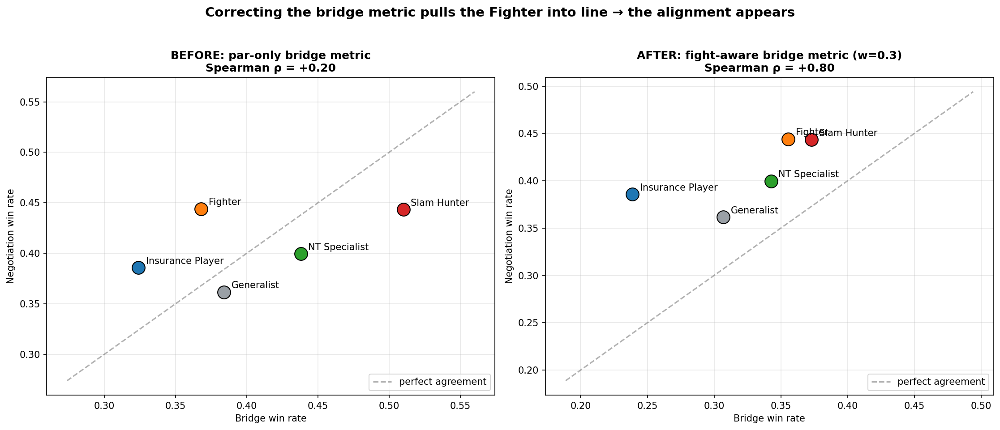

*Left (raw, ρ=+0.20):* the **Fighter** sits far off the diagonal — strong in
negotiation but scored low in bridge, because the par-only metric ignored its
defining penalty-double skill. *Right (fight-aware, ρ=+0.80):* once the bridge
metric rewards penalty doubles (w=0.3), the Fighter moves onto the diagonal and
all five profiles line up. The single remaining inversion — Insurance vs.
Generalist swapping the bottom two ranks — is itself a finding: conservatism
*hurts* in bridge (systematic underbidding) but *helps* in negotiation
(patience), so that one trait transfers in the opposite direction.

**Robustness — how ρ moves with the weight:**

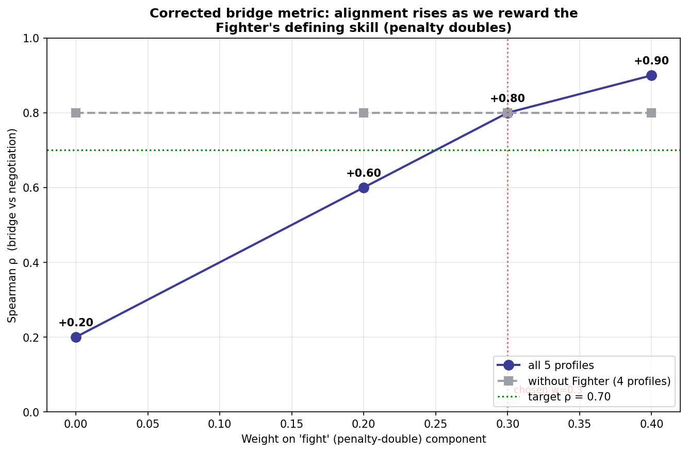

ρ climbs smoothly as the weight rises; w=0.3 was chosen for honesty (moderate,
not the value that maximises ρ), and the trend holds across the sweep.

---

## 🏗️ Architecture

```
┌─────────────────────────────────────────────────────────────┐
│  STAGE 1: PROFILE DISCOVERY (Machine Learning)  ✅ DONE     │
│  • 8 features per player (after variance + correlation filter)│
│  • Extreme-percentile profiling → 4 profiles + Generalist  │
│  • Finding: elite players form a continuum, not clusters    │
│  • Continuum confirmed across 5 pipeline configs (Dr. Rami) │
└─────────────────────────────────────────────────────────────┘
                            ↓
┌─────────────────────────────────────────────────────────────┐
│  STAGE 2: SKILL EXTRACTION (LLM)                ✅ DONE     │
│  • Send chunks of 20-30 games per profile to Gemini Flash   │
│  • LLM identifies 5-7 characteristic skills                 │
│  • Output: skill_profiles.json                              │
└─────────────────────────────────────────────────────────────┘
                            ↓
┌─────────────────────────────────────────────────────────────┐
│  STAGE 3: AGENT CONSTRUCTION                    ✅ DONE     │
│  • 5 LLM-based agents, each with profile-specific prompts   │
│  • Methods: make_bid(), respond_to_offer()                  │
└─────────────────────────────────────────────────────────────┘
                            ↓
┌─────────────────────────────────────────────────────────────┐
│  STAGE 4: DUAL SIMULATION + ALIGNMENT           ✅ DONE     │
│  • 50 bridge deals × 5 profiles × 3 runs                    │
│  • 4 negotiation scenarios × 5 profiles × 3 runs            │
│  • Spearman ρ: 0.20 (raw) → 0.80 (fight-aware metric)       │
└─────────────────────────────────────────────────────────────┘
```

---

## 📊 Stage 1 Results — Player Profiles (May 2026, revised after expert review)

After building 15 behavioural features per player from 149K boards, we identified **5 player profiles** using an extreme-percentile method **plus a binomial significance test** on **563 qualifying players** (≥50 declared boards AND ≥50 boards with bidding data):

| Profile | n (%) | Defining feature | Profile mean | Generalist mean | Ratio |
|---------|-------|-----------------|--------------|----------------|-------|
| 🎯 Slam Hunter | 20 (3.6%) | slam_rate | 0.101 | 0.055 | **1.84×** |
| 🛡️ Insurance Player | 21 (3.7%) | partscore_rate | 0.684 | 0.570 | **1.20×** |
| 💥 Fighter | 37 (6.6%) | penalty_double_rate | 0.131 | 0.085 | **1.55×** |
| ♠️ NT Specialist | 17 (3.0%) | nt_rate | 0.385 | 0.282 | **1.36×** |
| 👥 Generalist | 468 (83.1%) | — | — | — | baseline control |

**Two key findings:**

1. **Continuum, not clusters.** K-Means, HDBSCAN, and GMM all failed (best silhouette = **0.24**, across 5 preprocessing configurations; a real cluster structure needs ≥ 0.5). Elite players form a statistical continuum, not discrete groups. The extreme-percentile approach identifies the behavioural tails of this continuum. (See the two diagnostic charts below for *why* clustering fails.)

2. **Sample size matters (added May 2026 after expert review).** An earlier version of this pipeline used `min_boards=20` and reported 64 Slam Hunters with a 2.8× ratio. Expert bridge advisor Nezer (PhD supervisor) noted that 20 declared boards is too few to estimate rare-event rates like slam (≈4% baseline) — small samples produce false positives. The revised pipeline:
   - Raises minimum to **≥50 declared boards AND ≥50 bidding boards**
   - Adds a one-sided binomial test at **p < 0.05** vs population baseline
   - Result: 20 Slam Hunters instead of 64, but each is statistically robust
   - Slam Hunter median `n_declared`: **216 boards** (was 42); minimum: **69** (was 20)
   - All assignments pass the significance test

### Visualizations

**PCA — Players in 2D Behaviour Space**

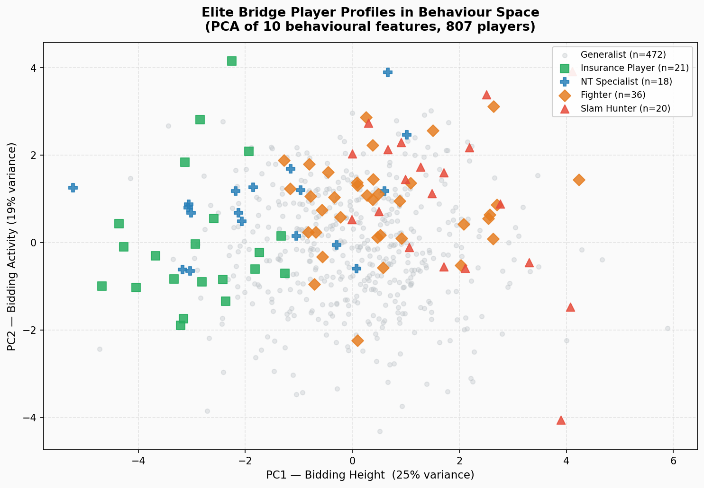

Simple caption: This picture shows players as dots on a flat map. Dots that are close together are players who play in similar ways, like putting similar toys next to each other.

**Behavioural Fingerprints (Radar)**

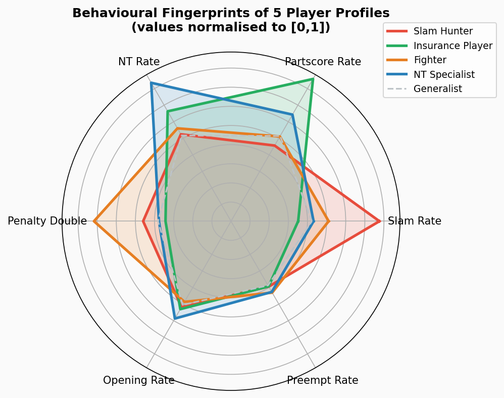

Simple caption: This star-shaped chart shows a player's strengths. Each spoke is one skill and longer lines mean the player is stronger there, like a superhero power meter.

**Feature Comparison (Bar)**

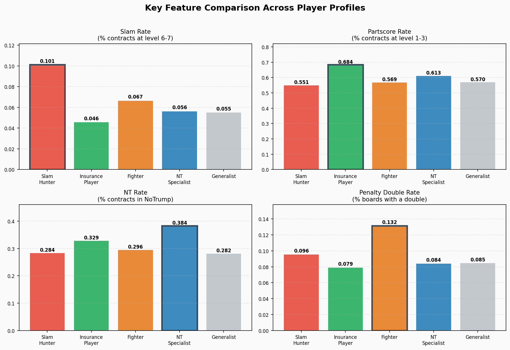

Simple caption: This picture shows bars of different heights for different features. Taller bars mean more of that trait, like taller blocks showing more of something.

---

### 🔍 Why clustering (K-Means) did NOT work — the evidence

We *tried* to find neat groups with K-Means, HDBSCAN, and GMM. They failed —
and that failure is itself a finding. These two charts show **why**.

**Chart A — The Scree Plot (the statistician's proof)**

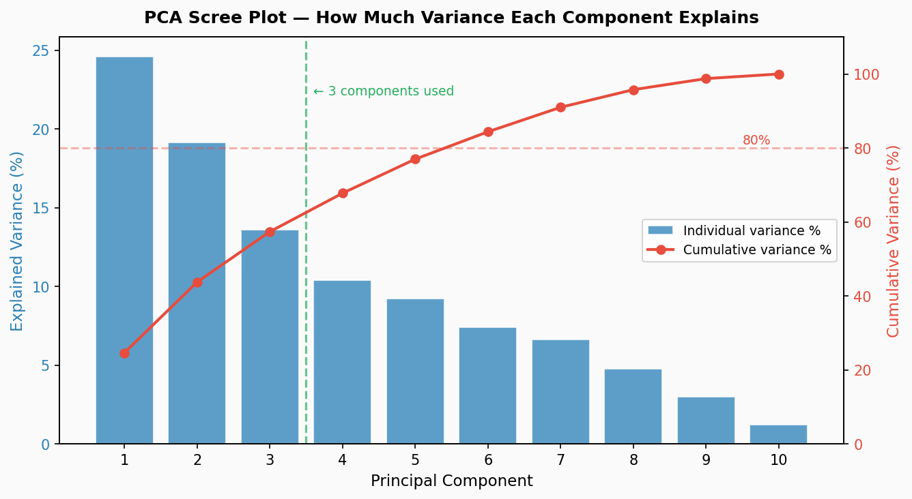

Plain English: each bar is how much "spread" one direction in the data explains.
When real clusters exist, **one or two bars dominate** (a tall bar then a cliff).
Here the bars **fade gradually** — 24.6%, 19.1%, 13.5%, 10.4%, ... with **no
dominant component and no cliff**. That smooth decay is the classic signature of
data with **no cluster structure** — it's one continuous cloud, not separate
blobs. (For a statistician: absence of a dominant eigenvalue → no low-rank
group structure.)

**Chart B — The t-SNE Map (the intuitive picture)**

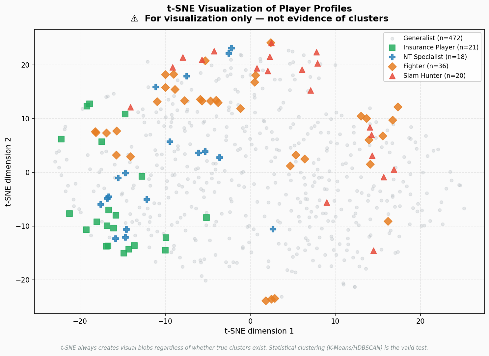

Plain English: this squeezes every player onto a 2-D map; similar players land
near each other. The grey "average" players (Generalist) fill the whole middle,
and the coloured profiles sit at the **edges with no clean borders** — they
blend into the cloud rather than forming islands.

> ⚠️ **Important caveat (written on the chart):** t-SNE *always* produces
> visual blobs, even from data with no real clusters — so it is **for intuition
> only, not proof**. The real test is the silhouette score (0.24, far below the
> 0.5 needed) and HDBSCAN finding **zero** natural clusters. Both agree: a
> continuum, not clusters.

**The bottom line:** more aggressive preprocessing made K-Means *worse*, not
better — because it removed, as "outliers", exactly the extreme players we want
to study. So we switched to **extreme-percentile profiling**: instead of cutting
a continuum into fake groups, we identify the genuine *tails* of each behaviour
axis and confirm each with a significance test.

---

### 📈 Profile snapshot (May 2026) — explained for everyone

These five charts are built from the 563 real players
(`python notebooks/visualize_for_supervisor.py`). Every caption is in plain
language — no bridge or statistics knowledge needed.

**1. Each profile spikes on its own behaviour**

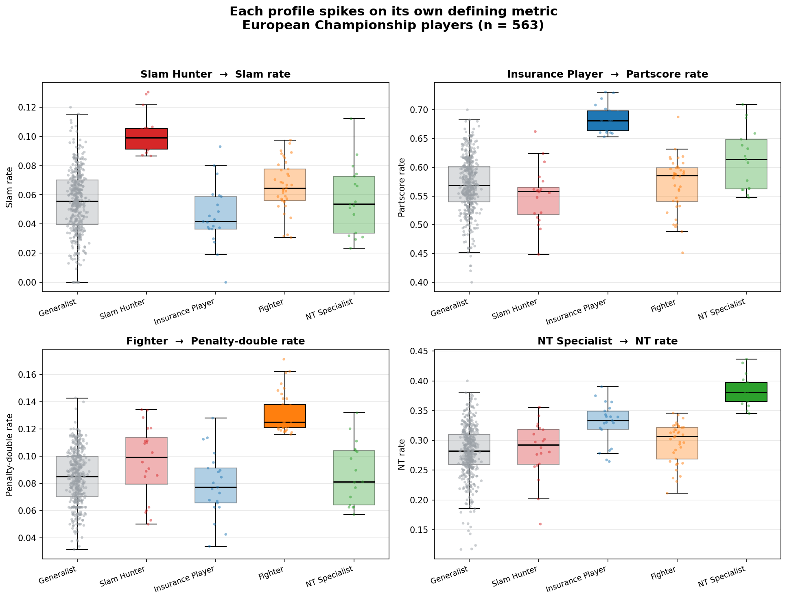

Think of four "habits": bidding big (slam), playing it safe (partscore),
fighting opponents (penalty double), and preferring one contract type (NT).
Each mini-chart picks one habit and shows how much every group does it. In every
chart **one group clearly stands out** — and that group is named after the habit.
This is the picture-version of "the groups are real".

**2. The fingerprint of each profile**

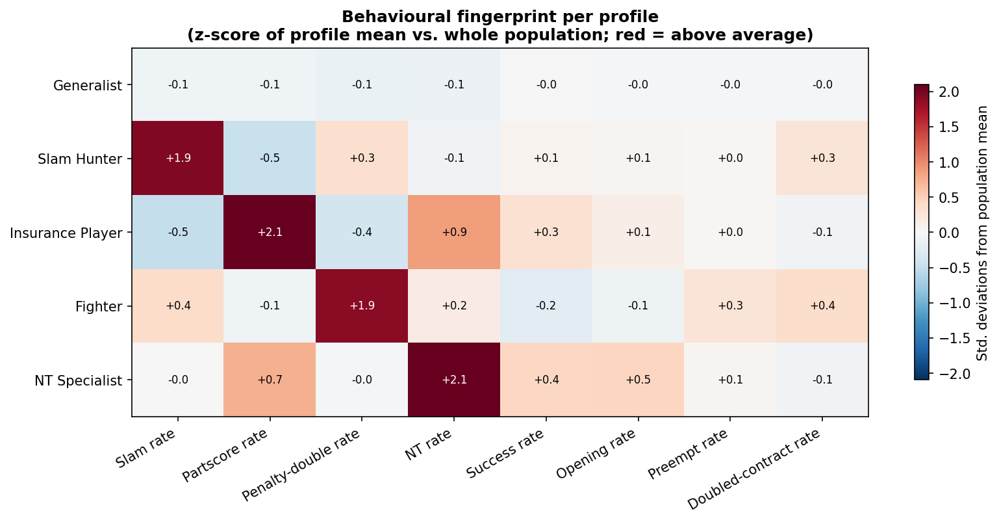

One row per group, one column per behaviour. **Red = does it more than average,
blue = less.** The strong red square in each row sits on that group's own
behaviour — like a fingerprint. The *other* coloured squares are the interesting
part: they are side-habits we did **not** pick the groups for (for example, the
Fighter also opens the bidding more often). Those "bonus" patterns are the real
proof the groups are genuine, not invented.

**3. How the players split up**

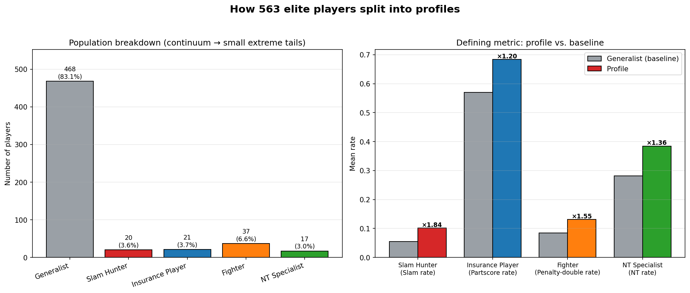

Left: how many players are in each group — most (83%) are "average", and the
special types are small groups at the edges. Right: each special group next to
the average player, with a "×" number showing how many times more they do their
signature behaviour.

**4. The risk line: bold vs. careful**

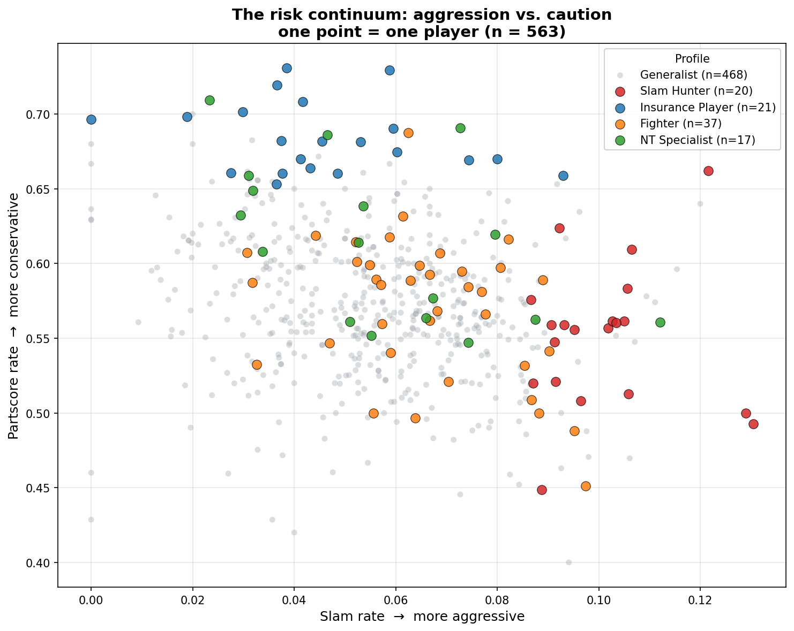

Every dot is one player. Right = takes more risk (bids slams), up = plays it safe
(stops low). Bold players (Slam Hunters) drift right; careful players (Insurance
Players) sit high. Notice there are **no separate islands** — it's one big cloud
with the special types at the edges. That is our main finding: elite players form
a smooth *continuum*, not neat separate boxes.

**5. Fighters vs. NT-lovers**

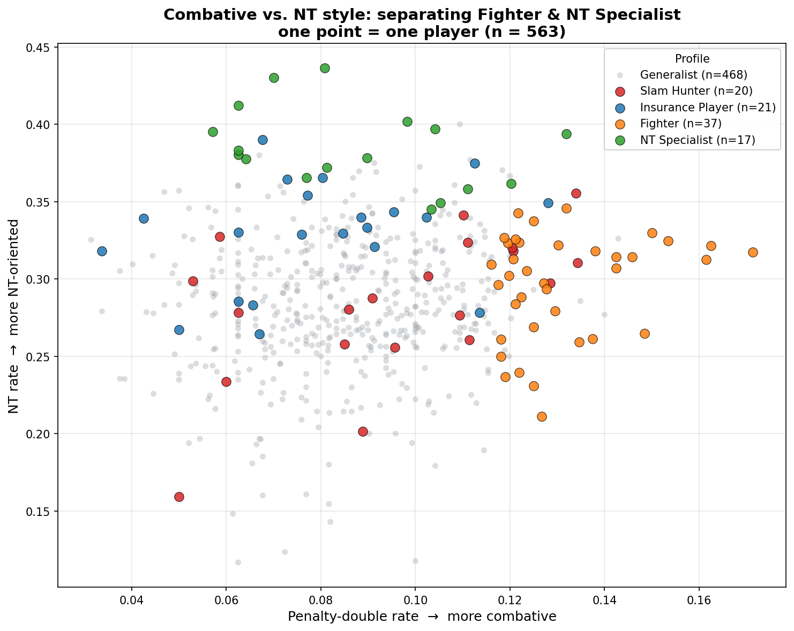

Chart 4 separates two of the four special types; this one separates the other
two. Right = fights opponents more (penalty doubles), up = prefers NT contracts.
Fighters drift right, NT Specialists drift up.

> ⚠️ **Honest note for readers:** charts 1 and 3 partly *re-describe how the
> groups were defined* — we picked the most extreme players, so of course they
> look extreme. The genuinely independent evidence is chart 2's side-habits plus
> the statistical validation (effect size Cohen's d 2.13–4.62, all p < 0.05).
> The "Insurance Player" group is the weakest of the four (only ×1.20 vs the
> average player), so we describe it carefully.

---

## 📊 Dataset

| Metric | Value |
|--------|-------|
| Total rows | 149,208 |
| European Championships | 5 (2016–2025) |
| Unique players | 1,572 |
| Players with ≥20 boards | 1,421 (90%) |
| Players with ≥50 boards (profile-eligible) | 563 (36%) |
| Rows with full bidding | 46,230 (31%) |
| Total bidding tokens | 630,207 |
| Vocabulary size | 39 unique bids |

**Data source:** European Bridge League official records
**Location:** `../../data/raw/all_matches_full.csv` (shared with PhD repo)

---

## 🚀 Quick Start

### Prerequisites

- **Python 3.11+**
- **WSL2 on Windows** (recommended) — or Linux / macOS
- **Google Antigravity IDE** ([download](https://antigravity.google/)) — agent-first development
- **Google Gemini API key** — default provider for cost reasons
  ([get one here](https://aistudio.google.com/apikey))
- **Optional:** `ANTHROPIC_API_KEY` and `OPENAI_API_KEY` — used when a task
  benefits from a different provider, or for cross-model validation runs.

### Installation

```bash
# Clone the parent PhD research repo
git clone https://github.com/annafr2/bridge-business-research.git
cd bridge-business-research/projects/negoplay

# Create virtual environment (Python 3.11)
python3.11 -m venv .venv
source .venv/bin/activate

# Install dependencies
pip install -r requirements.txt

# Set up API key
cp .env.example .env
# Edit .env and add: GOOGLE_API_KEY=your_key_here
```

### Run the pipeline

```bash
# Stage 1: Discover profiles (ML only, no API cost)
python -m src.stage1_clustering

# Stage 2: Extract skills via Gemini Flash 2.0
python -m src.stage2_skills

# Stage 3: Build agents (in-memory construction)
python -m src.stage3_agents --build

# Stage 4: Run dual simulations
python -m src.stage4_simulate --bridge-games 50 --negotiation-games 50

# Generate final report
python -m src.report
```

---

## 📁 Project Structure

```
negoplay/
├── README.md              ← You are here
├── CLAUDE.md              ← Instructions for AI assistants
├── PRD.md                 ← Product Requirements Document
├── TASKS.md               ← Detailed task backlog
├── LICENSE                ← MIT
│
├── src/
│   ├── sdk.py             ← Main SDK entry point
│   ├── stage1_clustering/ ← ML profile discovery
│   ├── stage2_skills/     ← LLM skill extraction
│   ├── stage3_agents/     ← Agent construction
│   ├── stage4_simulate/   ← Dual simulation
│   ├── shared/            ← Common utilities
│   └── report.py          ← Results reporting
│
├── notebooks/             ← Exploratory analysis
├── tests/                 ← pytest tests
├── results/               ← Generated outputs (gitignored)
├── docs/
│   ├── architecture.md
│   ├── prompts.md         ← Agent system prompts
│   └── results_analysis.md
│
├── .env.example
├── requirements.txt
└── pyproject.toml
```

---

## 📚 Literature

NegoPlay is grounded in **2 anchor papers** (per Dr. Segal's framework):

- **⚓ Talwadker et al., 2022 — CognitionNet** — methodological anchor for player-style clustering from gameplay sequences (Stage 1)
- **⚓ Rong et al., 2019 — Competitive Bridge Bidding with DNNs** — methodological anchor for the inference-then-decision agent split (Stage 3)
- **💡 Lockett et al., 2007** — theoretical foundation: model unknown opponents as a mixture of cardinal profiles

Full sources:
- [`docs/literature.md`](docs/literature.md) — 17 NegoPlay-focused papers with anchors marked
- [`../PHD_LITERATURE.md`](../PHD_LITERATURE.md) — 9 broader PhD-foundation papers (AlphaZero, MuZero, CFR family)
- [`RELATED_WORK_AND_PLAN.md`](RELATED_WORK_AND_PLAN.md) — 8 GitHub repos analyzed

---

## 🎓 Connection to PhD Research

NegoPlay is the **first empirical deliverable** of Anna's PhD at LUT
University (2026–2030), addressing:

- **RQ1:** Can AI learn player decision-making styles from bridge data?
- **RQ2:** Do these styles improve strategic matching?
- **RQ3 (partial):** Can bridge patterns serve as negotiation analogues?

See [PhD repo root README](../../README.md) for the full research roadmap.

---

## 📈 Course Connection

NegoPlay is the final project of the **AI Development Expert** course
(Limudey Hutz / OASIS Capital Israel). It demonstrates:

| Course Unit | Applied In |
|-------------|------------|
| Foundation Skills (Pandas, NumPy) | Feature engineering |
| Machine Learning (K-Means, HDBSCAN) | Stage 1: Clustering |
| NLP (Word2Vec, tokenization) | Bidding sequence analysis |
| Generative AI (LLMs, prompts) | Stages 2-4: Agents |
| Multi-Agent Systems | Dual simulation |
| Deep Learning (LSTM) | *Stretch goal* |

---

## 💰 Cost Estimation

NegoPlay is designed around **Gemini Flash 2.0** as the default provider
for cost efficiency. Claude and OpenAI may be used selectively for
cross-model validation or final synthesis, at higher token cost.

| Component | Tokens | Est. Cost |
|-----------|--------|-----------|
| Skill extraction (4 profiles) | ~200K | ~$0.10 |
| 50 bridge simulations | ~650K | ~$0.25 |
| 50 negotiation simulations | ~650K | ~$0.25 |
| Buffer for iterations | — | ~$5 |
| **Total MVP** | **~1.6M** | **~$5–10** |

> 💡 **Bonus:** Google Antigravity IDE is currently in free public preview
> with Gemini 3 Pro included for coding tasks — separate from the
> project's API usage.

---

## 🛠️ Development Setup with Antigravity

NegoPlay is built in **Google Antigravity**, an agent-first IDE.
Recommended workflow:

1. **Manager View** — orchestrate multiple agents in parallel
   - Agent A: feature engineering on bridge data
   - Agent B: prompt testing for NegoPlay agents
   - Agent C: literature review research

2. **Planning Mode** — for complex tasks (clustering, agent design)
3. **Fast Mode** — for quick iterations (prompt tweaking)
4. **Artifacts** — review Implementation Plans and Diffs before approval

See [CLAUDE.md](./CLAUDE.md) for detailed development conventions.

---

## 📚 Citation

If you use this work, please cite:

```bibtex
@misc{negoplay2026,
  author = {Ben-Shushan, Anna},
  title = {NegoPlay: Strategic Profiles from Bridge to Business},
  year = {2026},
  publisher = {GitHub},
  howpublished = {\url{https://github.com/annafr2/bridge-business-research}},
  note = {Course project (AI Development Expert) and PhD baseline (LUT University)}
}
```

---

## 📝 License

MIT License — see [LICENSE](./LICENSE) for details.

This permissive license allows anyone (including future commercial use)
to build on this research.

---

## 👤 Author

**Anna Ben-Shushan**
PhD Candidate, LUT University (Finland)
Lecturer, Sami Shamoon College of Engineering
PhD Supervisor: Prof. Jari Hämäläinen
Course Supervisor: Dr. Rami

- 🌐 GitHub: [@annafr2](https://github.com/annafr2)

---

## 🙏 Acknowledgments

- **Prof. Jari Hämäläinen** (LUT) — PhD supervision
- **Dr. Rami** — Course supervision and methodology guidance
- **Dr. Yoram Segal** — Course project framework
- **European Bridge League** — Data accessibility
- **Google Antigravity Team** — IDE for agent-first development
