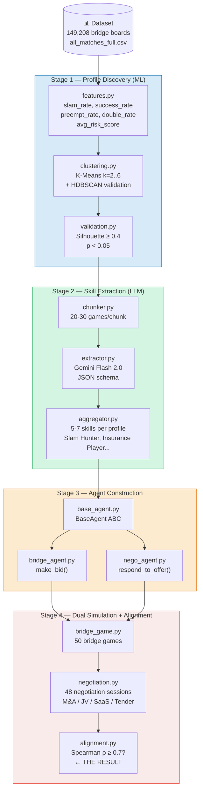

# NegoPlay — Architecture

## Four-Stage Pipeline



## Data Flow

```
data/raw/all_matches_full.csv          (read-only)
  ↓ src/stage1_clustering/features.py
data/processed/player_features.csv
  ↓ src/stage1_clustering/clustering.py
data/processed/player_clusters.csv
  ↓ src/stage2_skills/extractor.py     (Gemini Flash 2.0)
data/processed/skill_profiles.json
  ↓ src/stage3_agents/*.py
[agents in memory]
  ↓ src/stage4_simulate/*.py           (Gemini Flash 2.0)
results/bridge_simulations.jsonl
results/negotiation_simulations.jsonl
  ↓ src/stage4_simulate/alignment.py
results/alignment_report.md            ← FINAL OUTPUT
```

## LLM Provider Policy

| Task | Default | Alt |
|------|---------|-----|
| Skill extraction | Gemini Flash 2.0 | Claude / GPT for validation |
| Bridge agents | Gemini Flash 2.0 | Cross-model comparison |
| Negotiation agents | Gemini Flash 2.0 | Cross-model comparison |
| Final synthesis | Gemini 2.5 Pro | Claude Opus |

All calls route through `src/shared/llm_client.py` with `provider=` argument.
