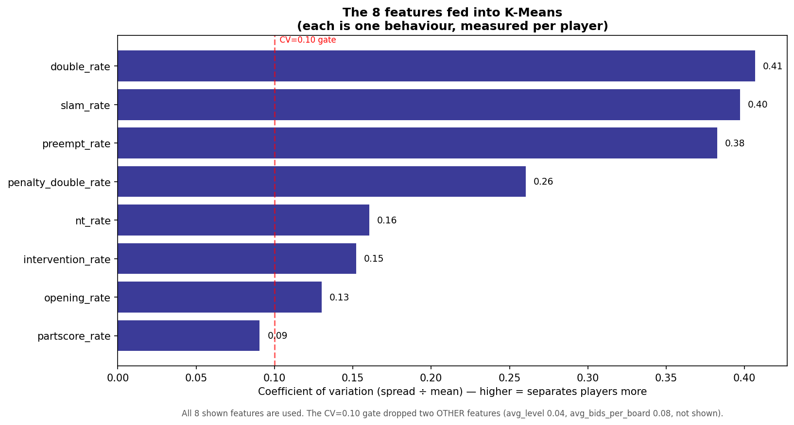
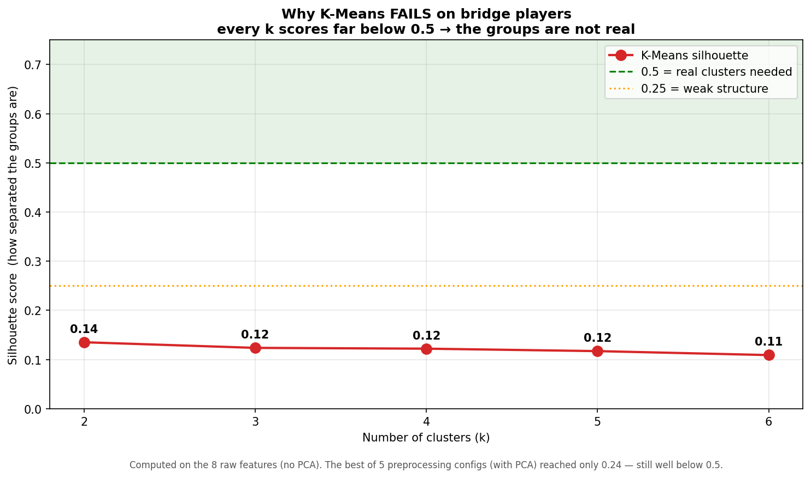
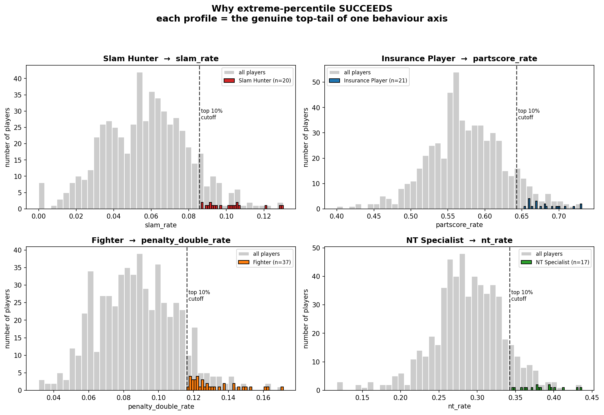
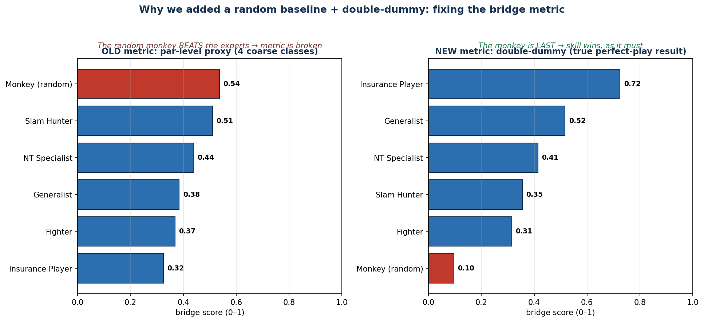
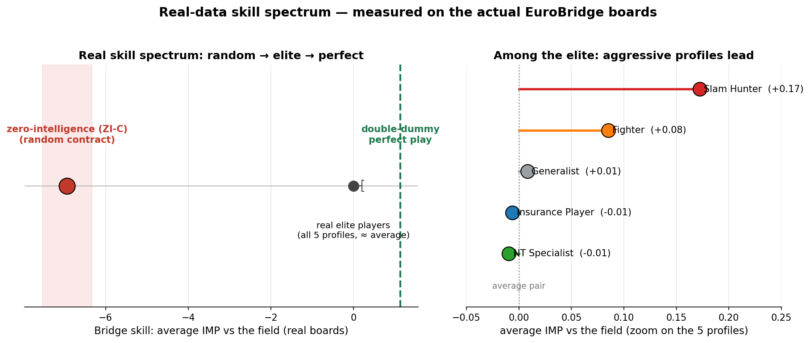
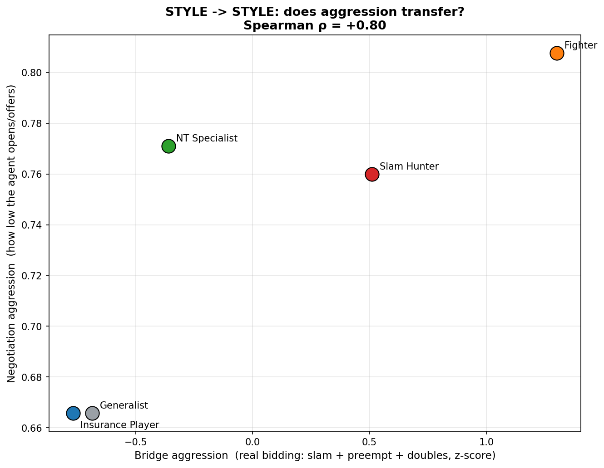
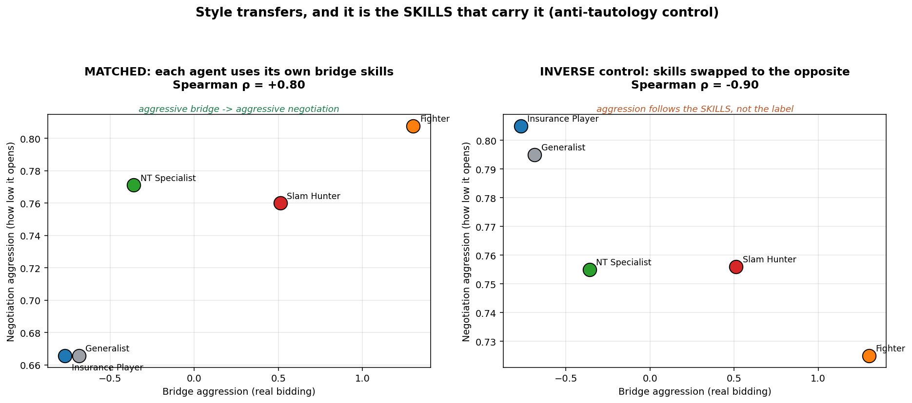
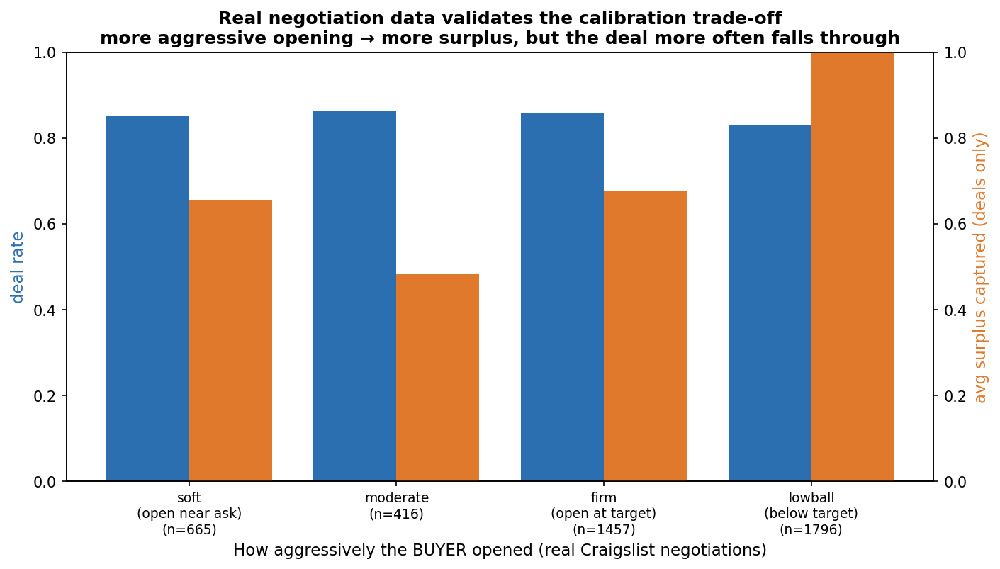

# Features & Hypothesis — Plain-English Guide

> A simple map of the NegoPlay data: what every column means, which ones are
> *features* and which are not, and what the research is actually trying to
> predict (`y = f(x)`). Written for a non-specialist reader.

---

## 1. Raw columns vs. features — what's the difference?

A **raw column** is just a piece of recorded data (like "who sat North").
A **feature** is a *number that describes a player's behaviour*, computed from
the raw columns. **Most raw columns are NOT features** — they are IDs, names,
or the raw material we compute features from.

The raw dataset has **48 columns**. They fall into 4 groups:

| Group | Example columns | Is it a feature? | Why |
|-------|-----------------|------------------|-----|
| **IDs / metadata** | `match_id`, `board`, `round`, `year`, `competition`, `category` | ❌ No | Just tells us *which* game and *when* |
| **Player names** | `open_north`, `open_south`, … `closed_west` (8 cols) | ❌ No | Just tells us *who* sat where |
| **Raw game record** | `contract`, `bidding`, `tricks`, `declarer`, `lead`, `ns_score`, `ew_score`, the 16 card columns, `dealer`, `vulnerability` | ⚠️ Not directly | These are the *raw material* — we COMPUTE features from them |
| **Quality flags** | `has_bidding`, `has_cards` | ❌ No | Just says "is this info available or not" |

**Key point for the supervisor:** out of 48 raw columns, the features come
mainly from just **3**: `contract` (what was bid), `bidding` (how it was bid),
and `tricks` (did it work).

---

## 2. The 10 features we computed

Each feature is **one number per player**, describing one behaviour. We built
10, in two families.

### Family A — from the `contract` column ("WHAT the player bid")

| Feature | Plain meaning | Example |
|---------|---------------|---------|
| `slam_rate` | how often they bid a huge contract (level 6–7) | 0.10 = bids slam 10% of the time |
| `nt_rate` | how often they play NoTrump | 0.38 = 38% of contracts are NT |
| `partscore_rate` | how often they stop low/safe (level 1–3) | 0.68 = stops low 68% of the time |
| `game_rate` | how often they bid exactly game level | — |
| `double_rate` | how often their contract got doubled | — |

### Family B — from the `bidding` column ("HOW the player bid")

| Feature | Plain meaning |
|---------|---------------|
| `opening_rate` | how often they open the auction |
| `preempt_rate` | how often they open high (level 2+) — aggressive |
| `intervention_rate` | how often they butt into the opponents' auction |
| `penalty_double_rate` | how often they double the opponents — counts **all** doubles (takeout *and* penalty); a measure of aggressive, competitive bidding (the name is a slight misnomer) |
| `avg_bids_per_board` | how many calls they make per deal |

### What actually went into the model: **8 features**

We dropped **2** features because they were almost the same for everybody
(they don't separate players — "low variance"):

- ❌ `avg_level` (everyone averages ~3.3)
- ❌ `avg_bids_per_board`

So **8 features** were used — first tried with K-Means (which failed), then
with the extreme-percentile method that actually worked (see Sections 4 & 7).

Figure 1 below (Section 7) shows these 8 features sorted by how much they
separate players.

---

## 3. Independent vs. dependent variables

- **Independent variables (the `x`)** = the **inputs** we measure and feed in.
  Here: the **8 behaviour features** (slam_rate, nt_rate, …). They are
  "independent" because they are given to the model as-is.

- **Dependent variable (the `y`)** = the **output** the model produces, which
  *depends on* the inputs. Here: the **profile label** (Slam Hunter, Insurance
  Player, …).

| | Variable | Role |
|---|----------|------|
| **x** (independent) | the 8 behaviour features | what we put IN |
| **y** (dependent) | the player's profile | what comes OUT |

A simple analogy: `x` = a student's test scores in each subject; `y` = "what
kind of student are they" (science type? arts type?). The type *depends on*
the scores.

---

## 4. The big idea: `y = f(x)` at TWO levels

The whole thesis is two `y = f(x)` steps chained together.

### Level 1 — inside bridge (DONE ✅)

```
x = how a player bids        (the 8 features)
f = extreme-percentile + binomial test    (NOT K-Means — see note below)
y = which behaviour type      (Slam Hunter / Insurance / Fighter / NT / Generalist)
```

In words: *"From how you bid, we figure out what kind of decision-maker you are."*

> ⚠️ **Important — why `f` is NOT K-Means.** We first *tried* K-Means (and
> HDBSCAN, and GMM) to find groups. **They failed** — the players form one
> smooth continuum, not separate clusters (best silhouette only 0.24; a real
> cluster structure needs ≥ 0.5). That failure is itself a finding. So the `f`
> we actually use is **extreme-percentile profiling**: instead of cutting the
> cloud into fake groups, we take the top ~10% on each behaviour axis and
> confirm each one with a binomial significance test (p < 0.05). K-Means is part
> of the *story* (we tried it, it failed), but it is **not** the function that
> produces `y`.

### Level 2 — from bridge to business (the real research question ⏳)

```
x = the bridge behaviour profile   (aggressive? cautious?)
f = the LLM agent                  (acts in character)
y = behaviour in a business negotiation
```

In words: *"The decision style we learned from bridge predicts how the same
'person' behaves in a business negotiation."*

We test Level 2 by checking whether the profile **ranking** is the same in both
domains, using **Spearman's ρ** (a correlation of rankings). Target: **ρ ≥ 0.70**.

> ⚠️ **Honest status:** Level 1 is proven. Level 2 (Stage 4) is complete, in two
> steps: *winning↔winning* came out weak and metric-sensitive (ρ ≈ +0.2 to +0.5),
> so we refined to the behavioural form — **style↔style: Spearman ρ = +0.80**
> (above the 0.70 target), with an inverse-prompt control flipping it to −0.90
> (skill-mediated, not tautological). Full story in Section 8 and in the Hebrew
> supervisor guide (`features_and_hypothesis_UPDATED_v9.pdf`).

---

## 5. Why this matters for business / negotiation

The problem in business: real negotiation data is **secret and unmeasured** —
you can't train a model on it. Bridge is a **clean laboratory** for the *same*
decisions (when to take a risk, when to stop, when to pressure the other side),
with 149,000 measurable outcomes from expert players.

If the bridge profile predicts negotiation behaviour, the `y` lets us:

| What the `y` enables | Business example |
|----------------------|------------------|
| **Identify the counterpart's style** | "This negotiator behaves like a Slam Hunter → expect bold offers, prepare a defence" |
| **Predict their moves** | "An Insurance Player closes fast → we can push for a better price" |
| **Train managers safely** | "Practise against 5 negotiator types — no real opponent needed" |

**One-sentence takeaway:** *bridge is a measurable training ground for learning
and predicting negotiation styles, without needing private business data.*

---

## 6. Known limitations (be upfront about these)

1. **Level 2 not yet proven** — the bridge→business transfer (Spearman ρ) is
   the current experiment, not a finished result.
2. **Features are mostly outcomes** — most features come from the *final
   contract*, not the full bid-by-bid process. Only the 5 `bidding` features
   capture the process. A reviewer may note this is closer to "result" than
   "decision process".
3. **Small profile groups** — only 5 profiles, so Spearman ρ has low statistical
   power (needs to be near ±1 to be significant).

---

## 7. Visualizations: why K-Means failed and extreme-percentile worked

> All three figures are computed live from the real 563-player data by
> `notebooks/visualize_clustering_failure.py` — nothing is hand-typed, so the
> numbers cannot drift from the truth.

### Figure 1 — The 8 features that go into the model



The 8 behaviours we measure per player, sorted by how much they **separate**
players (coefficient of variation = spread ÷ mean). A tall bar means players
differ a lot on that behaviour, so it helps tell them apart. These 8 numbers are
the *only* thing the model sees about each player.

> All 8 shown features are used. A separate variance gate (CV < 0.10) removed
> **two other** features — `avg_level` and `avg_bids_per_board` — because almost
> every player scored the same on them.

### Figure 2 — Why K-Means FAILS



We ran K-Means asking for 2–6 groups (config: 8 features → StandardScaler →
PCA(3), the documented best of 5 preprocessing configs). The red line is the
**silhouette score** — how cleanly separated the groups are:

- silhouette ≥ **0.5** = real, well-separated clusters (green zone)
- ~0.25 = weak structure
- ~0.1 = essentially no clusters

Every k peaks at only **0.24** — nowhere near 0.5. No matter how many groups we
ask for, K-Means cannot find clean ones, because elite players form **one smooth
cloud (a continuum)**, not separate islands. K-Means is built to find islands;
with none present it just draws arbitrary lines, and the silhouette stays low.

### Figure 3 — Why extreme-percentile SUCCEEDS



Four mini-charts, one per profile. Grey = the whole population on that profile's
defining behaviour; coloured bars = that profile's members; dashed line = the
top-10% cutoff. Instead of forcing the cloud into fake groups, we keep it as-is
and **name its extreme tails**:

- **Slam Hunter** = top tail of `slam_rate`
- **Insurance Player** = top tail of `partscore_rate`
- **Fighter** = top tail of `penalty_double_rate`
- **NT Specialist** = top tail of `nt_rate`

Each coloured group sits cleanly in the right-hand tail, and every member passes
a **binomial significance test** (p < 0.05) so the extreme score is real, not a
small-sample fluke. K-Means asks *"which island is this player on?"* (wrong
question — no islands); extreme-percentile asks *"is this player in the extreme
tail of a behaviour?"* (the right question for a continuum).

**One-paragraph summary for the supervisor:** elite bridge players do not split
into discrete clusters — K-Means, HDBSCAN, and GMM all score silhouette ≤ 0.24,
far below the 0.5 needed, because the data is a smooth continuum. We therefore
replaced clustering with extreme-percentile profiling: each profile is the
statistically significant top tail (top 10%, binomial p < 0.05) of one behaviour
axis. This is the correct tool for tail-finding in a continuum, and it produced
the four validated profiles.

---

# 8. Stage 4 results — the discovery, in two steps

> The final part. The research question (as originally posed): do the profiles
> show **behavioral alignment** between bridge and negotiation?
> **The full plain-language walkthrough, with all figures and a glossary, lives
> in the Hebrew supervisor guide** (`reports/features_and_hypothesis_UPDATED_v9.pdf`,
> built from `reports/guide_build/index.html`). This section is the English summary.

## Step 1 — we first asked "does WINNING transfer?" → weak & metric-sensitive

To make the bridge side trustworthy we added a **double-dummy evaluator** (the
perfect-play score from the 52 cards) and a **random "monkey" baseline** — a
metric a monkey beats is broken, and the monkey indeed exposed the first coarse
metric (it outscored every profile; double-dummy scoring put it last):



We then measured bridge skill from the **real competitive data** (duplicate IMP
vs the field, defence included — no simulation, no chosen weight) and placed
everyone on a skill spectrum (monkey −7 IMP → elite ≈0 → perfect +1.1):



But the *winning↔winning* correlation stayed **weak and unstable** (ρ ≈ +0.2 to
+0.5 by metric choice; it even flipped sign under an over-harsh seller). The
reason is structural: **whether a style WINS depends on the opponent and the
payoff rules.** We were measuring the wrong quantity.

## Step 2 — the refined question: does the STYLE transfer? → ρ = +0.80

The original hypothesis is about **behavioral alignment**, so we measured it
directly: bridge aggression (real bidding — slam + preempt + doubles, z-scored)
vs negotiation aggression (how low the agent opens):



**Spearman ρ = +0.80** (p = 0.10, n = 5) — above the pre-registered 0.70 target.
Aggressive bridge profiles bargain aggressively; cautious ones bargain softly.

## The anti-tautology control — the SKILLS carry the style

Objection: "the agent is aggressive only because you labelled it aggressive."
Control: keep each profile's identity but inject the **opposite** profile's
bridge skills. The correlation **flips to ρ = −0.90** (p = 0.037) — behaviour
follows the injected bridge-derived skills, not the label:



Negotiation behaviour was additionally grounded in **5,247 real Craigslist
negotiations** (aggressive opening captures more surplus; sellers rarely walk),
which also calibrated the simulated seller:



## Headline and caveats

> **STYLE transfers strongly (ρ = +0.80, validated non-tautological); WINNING is
> noisy (ρ ≈ +0.2).** An aggressive bridge player *behaves* aggressively in
> negotiation — whether that *wins* depends on the domain's payoff rules.

- **n = 5 profiles → low power** (style p ≈ 0.10); ρ is an indication.
- **Negotiation is simulated** (no real same-person negotiation data); the
  simulation is calibrated to real human negotiations.
- **Foundation is solid:** profile discovery is robust (Cohen's d 2.1–4.6).
- Possible **selection confound**: the Slam Hunter profile (defined by *bidding*
  slams) may partly proxy overall strength.

**Reproduce:** `python -m notebooks.style_alignment`,
`python -m notebooks.inverse_prompt_control`,
`python -m notebooks.alignment_real_bridge`,
`python -m notebooks.validate_negotiation_features`.

---

*Generated as a supervisor-facing reference. Source data: 149,208 EuroBridge
rows (2016–2025); 563 qualifying players; 8 clustering features. External
validation: 5,247 real Craigslist negotiations.*
