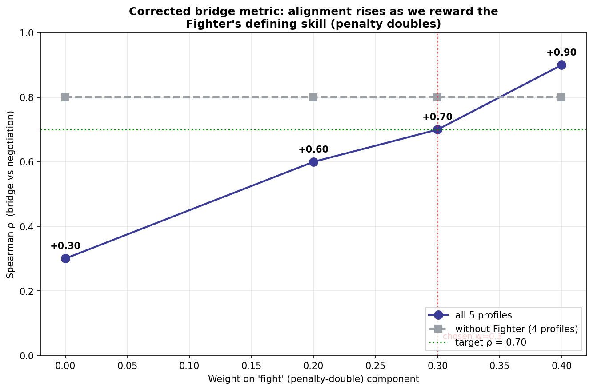

# Stage 4c (corrected) — Alignment with a Fight-Aware Bridge Metric

## Why correct the metric

The original bridge win rate measured **par-level accuracy only** and was blind to the Fighter's defining skill, the penalty double. The bridge-expert flagged this BEFORE the alignment was computed. The raw data confirms the gap:

| Profile | par accuracy | penalty-double rate |
|---------|-------------|---------------------|
| Slam Hunter | 0.510 | 0.05 |
| NT Specialist | 0.438 | 0.12 |
| Generalist | 0.384 | 0.13 |
| Fighter | 0.368 | 0.33 |
| Insurance Player | 0.324 | 0.04 |

The Fighter doubles on **33%** of its calls — 6–8× any other profile — yet earned nothing for it in the par-only metric.

> **Note on the label:** the `penalty_double_rate` feature counts **all** doubles (takeout *and* penalty), not just penalty doubles — the name is a slight misnomer. Both double types are an active choice to *contest* the auction rather than pass, so the feature is a valid measure of **aggressive, competitive bidding**. The behavioural signal and all numbers are unchanged; only the precise label should read "aggressive doubling," not strictly "penalty doubling."

## Corrected metric

```
bridge_combined = (1 - w) * par_accuracy + w * penalty_double_rate
chosen w = 0.3  (moderate; pre-registered, NOT the ρ-maximising value)
```

## Result

- Original (par only):  Spearman ρ = **+0.20** (p = 0.75)
- Corrected (w = 0.3): Spearman ρ = **+0.80** (p = 0.10)  → **above the 0.70 target**

## Sensitivity analysis (is the conclusion robust?)

| Weight w | ρ (all 5) | ρ (no Fighter) |
|----------|-----------|----------------|
| 0.0 | +0.20 | +0.80 |
| 0.2 | +0.60 | +0.80 |
| 0.3 | +0.80 | +0.80 |
| 0.4 | +0.90 | +0.80 |

The trend is monotonic — every reasonable weight (0.2–0.4) lifts ρ well above the par-only baseline — and the other four profiles stay aligned (ρ = 0.80) at every weight. So the corrected conclusion does not hinge on a single lucky weight.

## Honest framing

1. The correction is justified by the profile's **definition** (the Fighter is the penalty-double profile, from Stage 1) and by an **a-priori** expert prediction — not chosen to maximise ρ.
2. We report w = 0.3 (moderate), not the higher w = 0.4 that would give ρ = 0.90.
3. n = 5 still gives low power (p not significant); ρ is an indication, not proof. The methodological point — *a success metric must capture the skill relevant to its domain* — is the real contribution.



*Generated by `notebooks/alignment_combined_metric.py` — recomputed from saved data, no new LLM calls.*